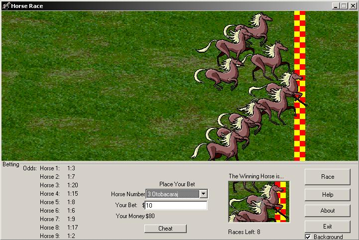



## Horse Racing Game

### Description

This is a game where you have to bet on the outcome of a horse race. Each horse has its own odds of winning, and you are awarded money based on the odds of the horse winning. I didn't make it exactly like how you bet in real life, because im only 14, and dont know how it works. Please tell me if you like it. Vote if you want
 
### More Info
 

             |
---                |---
**Submitted On**   |2004-07-30 22:40:54
**By**             |[Tim Heap](https://github.com/Planet-Source-Code/PSCIndex/blob/master/ByAuthor/tim-heap.md)
**Level**          |Intermediate
**User Rating**    |5.0 (10 globes from 2 users)
**Compatibility**  |VB 5\.0, VB 6\.0
**Category**       |[Games](https://github.com/Planet-Source-Code/PSCIndex/blob/master/ByCategory/games__1-38.md)
**World**          |[Visual Basic](https://github.com/Planet-Source-Code/PSCIndex/blob/master/ByWorld/visual-basic.md)
**Archive File**   |[Horse\_Raci1775897312004\.zip](https://github.com/Planet-Source-Code/tim-heap-horse-racing-game__1-55163/archive/master.zip)

